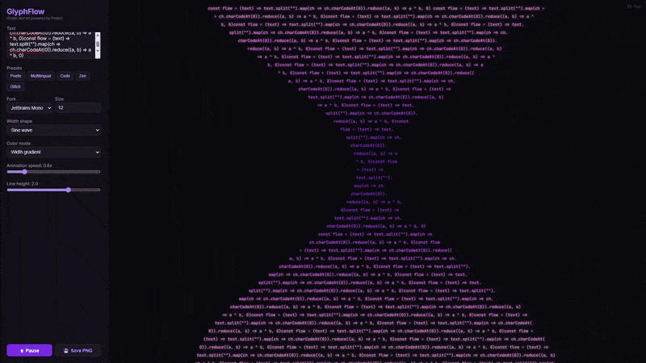

# GlyphFlow

> Kinetic text art generator — text shaped into animated forms, rendered to Canvas at 60fps with zero DOM measurement.



Powered by [@chenglou/pretext](https://github.com/chenglou/pretext), a pure JavaScript library that measures and lays out multiline text without triggering DOM reflow. GlyphFlow uses its `layoutNextLine()` API to assign a different width to every line, creating dynamic shapes (sine waves, funnels, diamonds) that animate in real-time.

Because Pretext's layout is pure arithmetic over cached measurements, it can run every animation frame without jank — something impossible with traditional DOM-based text measurement.

## Features

- Variable-width line layout with animated shape functions (sine, funnel, diamond, heartbeat)
- Multiple color modes (gradient, rainbow, thermal, monochrome)
- Multilingual text support (Latin, CJK, Arabic, emoji)
- Real-time controls for font, size, shape, speed, and line height
- Export current frame to PNG
- Zero DOM text measurement — everything renders to Canvas

## Quick Start

```bash
docker compose up --build -d
```

Open [http://localhost:3000](http://localhost:3000). To stop:

```bash
docker compose down
```

## Local Development

Requires [Node.js](https://nodejs.org/) >= 18.

```bash
npm install
npm run dev
```

## How It Works

1. Text is prepared once via `prepareWithSegments()` — segments are measured using the browser's Canvas font engine
2. Each animation frame, `layoutNextLine()` is called per line with a width determined by the active shape function and current time
3. Lines are centered and rendered to Canvas with color derived from width ratio
4. Shape guide lines are drawn as subtle overlays

The key insight: because layout is a pure function of (prepared text, width), you can call it thousands of times per second with different widths and get instant results.

## Tech Stack

- [@chenglou/pretext](https://github.com/chenglou/pretext) — text measurement and layout engine
- [Vite](https://vite.dev/) — build tool
- Vanilla JS — no framework dependencies
- Canvas API — rendering
- Docker — containerized build and serve

## Contributing

See [CONTRIBUTING.md](CONTRIBUTING.md) for guidelines.

## License

[MIT](LICENSE)
